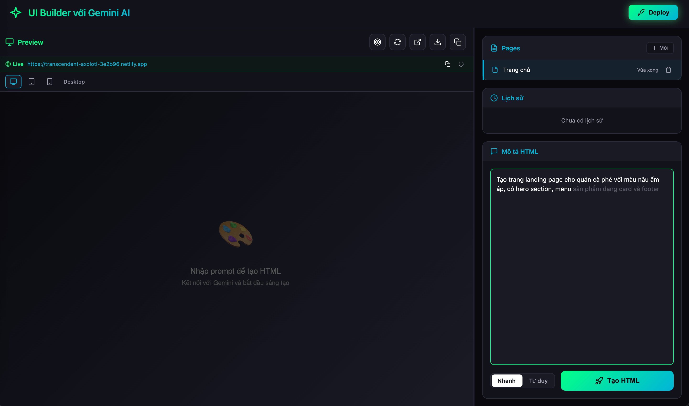
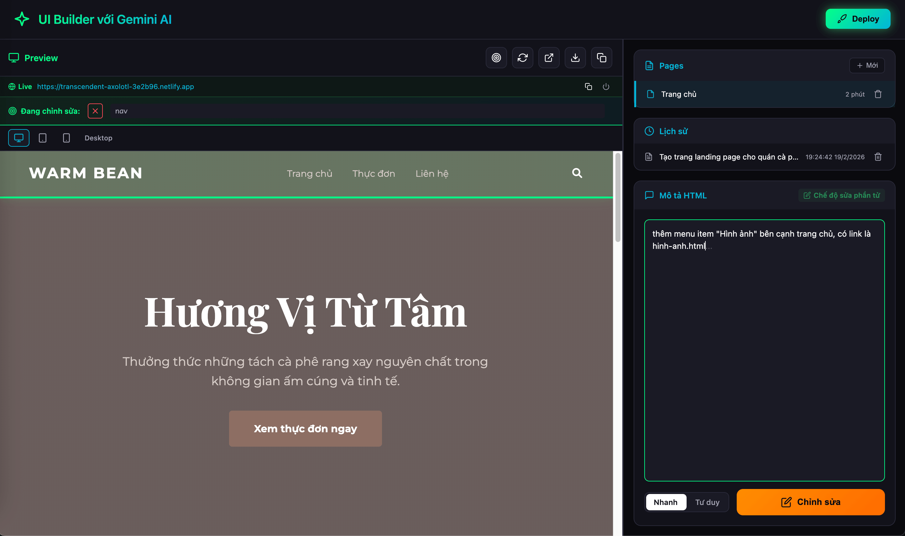
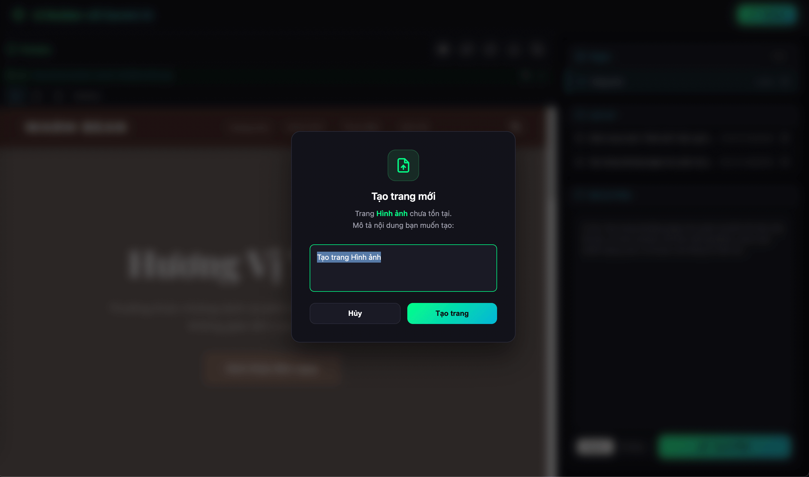
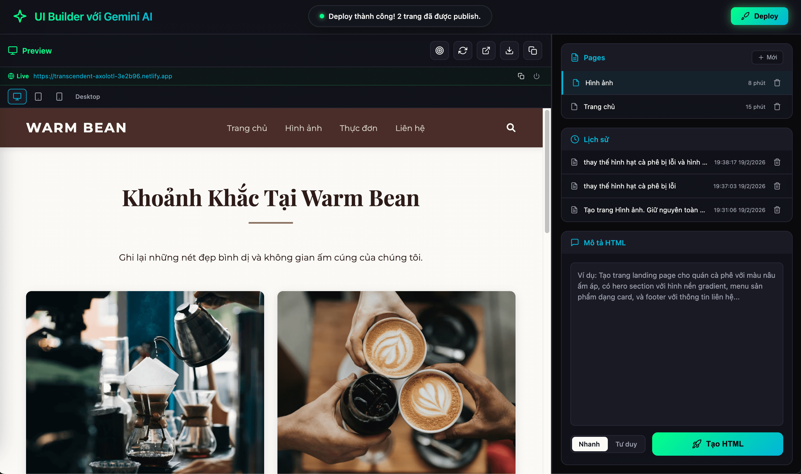

# Tạo HTML với Gemini AI — Chrome Extension

Chrome Extension tạo website HTML/CSS/JS hoàn chỉnh bằng Gemini AI — preview trực tiếp, inspect & chỉnh sửa phần tử, quản lý đa page, gợi ý prompt AI, deploy multi-page lên Netlify.

## Tính năng

### Tạo HTML bằng AI
- Mô tả UI bằng ngôn ngữ tự nhiên (tiếng Việt), Gemini sinh HTML hoàn chỉnh (single-file, inline CSS/JS)
- **Hai chế độ AI**: Flash (nhanh) và Thinking (tư duy sâu) — chuyển đổi bằng toggle switch
- **Chỉnh sửa lặp lại** — prompt tiếp theo tự động bao gồm HTML hiện tại, AI chỉ thay đổi phần được yêu cầu mà bảo toàn CSS/cấu trúc
- **Conversation context** — mỗi page duy trì ngữ cảnh hội thoại riêng, các prompt tiếp theo hiểu context trước đó

### Inspect & Chỉnh sửa phần tử
- Bật chế độ **Inspect** → di chuột highlight phần tử → click chọn
- Mô tả thay đổi cho phần tử đã chọn → AI chỉ sửa innerHTML của phần tử đó
- Hiển thị CSS selector của phần tử đang chỉnh sửa

### Device Preview
- Xem trước ở 3 kích thước: **Desktop** (100%), **Tablet** (768px), **Mobile** (375px)
- Chuyển đổi nhanh bằng toolbar trên preview

### Quản lý đa Page
- Tạo, đổi tên (double-click), xóa nhiều page
- Mỗi page là workspace độc lập với conversation context riêng
- Chuyển page nhanh, JS trong page hoạt động đầy đủ nhờ sandbox blob URL

### Điều hướng Link & Tạo page tự động
- Click link trong preview → hiện modal tạo page mới hoặc chuyển đến page đã tồn tại
- Tên page lấy từ text của link (hỗ trợ tiếng Việt có dấu)
- Prompt được tách: user thấy prompt sạch, internal instructions tự động thêm phía sau
- Matching thông minh: so khớp bằng tên page + slug fallback (Vietnamese diacritics safe)

### AI Suggestions (Gợi ý prompt)
- Gợi ý tự động từ danh sách preset + AI-powered completion từ Gemini
- Ghost text hiển thị gợi ý, nhấn **Tab** để chấp nhận
- Cache LRU (50 items) tránh gọi API trùng lặp
- Hoạt động cả ở prompt chính và modal tạo page

### Lịch sử & Revert
- Mỗi lần tạo/chỉnh sửa được lưu (prompt + full HTML)
- Click mục lịch sử để xem lại phiên bản cũ
- **Revert** — prompt tiếp theo sẽ tiếp tục từ phiên bản đã revert

### Deploy lên Netlify (Multi-page)
- Kết nối bằng Netlify Personal Access Token
- **Một site duy nhất** cho tất cả các page — deploy/cập nhật cùng một URL
- Trang đầu tiên → `/index.html` (root), các trang khác → `/slug/index.html`
- **Tự động rewrite link giữa các page**:
  - Link có href thật (vd: `san-pham.html`) → match bằng tên page + slug
  - Link placeholder (`href="#"`) → match bằng nội dung text của link
- Auto-recreate site nếu bị xóa trên Netlify

### Các thao tác khác
- Refresh preview / mở trong tab mới / tải xuống HTML / copy HTML
- Khóa UI khi đang tạo (hiệu ứng shake-reject khi click)
- Tự động kết nối / tái kết nối Gemini
- Toast notification kiểu Dynamic Island

## Cài đặt

1. Mở Chrome → `chrome://extensions/`
2. Bật **Developer mode** (góc phải trên)
3. Click **Load unpacked** → chọn thư mục `extension-ui-builder`
4. Click icon extension trên toolbar để mở giao diện

## Sử dụng

1. **Mở giao diện** — Extension tự động mở tab Gemini và kết nối
2. **Chờ kết nối** — Đèn trạng thái chuyển xanh "Đã kết nối"
3. **Nhập prompt** — Mô tả website bạn muốn tạo (ghost text gợi ý khi gõ)
4. **Chọn model** — Flash (mặc định) hoặc Thinking
5. **Nhấn "Tạo HTML"** — Preview hiển thị bên trái
6. **Chỉnh sửa** — Prompt tiếp theo để sửa, hoặc Inspect để sửa từng phần tử
7. **Tạo multi-page** — Click link trong preview để tạo page mới liên kết
8. **Deploy** — Kết nối Netlify token → nhấn Deploy → tất cả page lên cùng một site

## Kiến trúc

```
Options Page ←─chrome.runtime─→ Background (SW) ←─chrome.tabs─→ Content Script ←─postMessage─→ Injected Script
 (Giao diện)                    (Điều phối)                     (gemini.google.com)              (Page Context)
      │
      │ postMessage
      ▼
 Sandbox Iframe (blob:// URL)
 (Preview HTML + Bridge Script)
```

| Thành phần | Vai trò |
|---|---|
| **options.js** | Controller chính — page, history, prompt, preview, inspect, deploy, AI suggestion, link modal |
| **background.js** | Service worker — điều phối message, quản lý tab Gemini, lưu suggestion context |
| **content.js** | Chạy trên gemini.google.com — cầu nối chrome.runtime ↔ window.postMessage |
| **injected.js** | Page context Gemini — trích xuất token xác thực, gọi StreamGenerate API, parse streaming |
| **db.js** | IndexedDB wrapper — lưu trữ pages và lịch sử HTML |
| **icons.js** | SVG icon library |

### Luồng tạo HTML

```
1. User nhập prompt → options.js
2. options.js xây dựng prompt (new / modification / element-edit) → background.js
3. background.js → content.js → injected.js
4. injected.js:
   - Trích xuất token (SNlM0e, bl, sessionId) từ page
   - POST /_/BardChatUi/data/assistant.lamda.BardFrontendService/StreamGenerate
   - Parse streaming response (chunked wrb.fr JSON)
   - Trích xuất HTML + conversationId / responseId / choiceId
5. Kết quả chảy ngược: injected.js → content.js → background.js → options.js
6. options.js: fix pipeline → preview → lưu IndexedDB → cập nhật history
```

### Xử lý prompt thông minh

| Tình huống | Cách xử lý |
|---|---|
| **Page trống** | Bọc prompt với hướng dẫn tạo HTML thuần (single-file, inline CSS, responsive) |
| **Có HTML + sửa đổi** | Gửi kèm HTML hiện tại + yêu cầu sửa + luật bảo toàn CSS/cấu trúc |
| **Chỉnh sửa phần tử** | Gửi outerHTML phần tử + yêu cầu → AI trả innerHTML mới |
| **Revert** | Đánh dấu trạng thái revert, prompt tiếp theo bao gồm context đã revert |
| **Tạo page từ link** | Tách user prompt (sạch) khỏi internal instructions (giữ style/header/footer) |

### HTML Fix Pipeline

Gemini đôi khi sinh HTML bị lỗi encoding. Pipeline tự động sửa trước khi preview:

| Hàm | Sửa lỗi |
|---|---|
| `fixMarkdownUrls` | URL bị wrap markdown `[url](url)` trong HTML attribute và `<script>` |
| `fixSuspiciousLinks` | `[suspicious link removed]` → detect library → inject CDN (Font Awesome, Bootstrap, AOS...) |
| `fixEncodedScripts` | Entity-encoded JS trong `<script>` (`&lt;`, `&amp;`...) → decode, escape `</script>` safety |
| `fixBackslashAmpersands` | `\&amp;` và `\&` trong URL attribute → `&` (skip script blocks) |
| `fixEscapedCSS` | `/\*` → `/*` và `\*/` → `*/` trong `<style>` blocks |

### Sandbox Preview

- Preview chạy trong iframe sandbox qua **blob:// URL** (không dùng `document.write()`)
- Mỗi lần chuyển page tạo blob URL mới → JS scope hoàn toàn sạch, không bị `const` redeclaration
- **Bridge Script** inject vào HTML: hỗ trợ inspect mode, link interception, element data access, innerHTML update
- Giao tiếp qua `postMessage` — parent gửi `PREVIEW_HTML`, sandbox gửi `SANDBOX_READY`

## Cấu trúc thư mục

```
extension-ui-builder/
├── manifest.json       # Chrome Extension manifest v3
├── background.js       # Service worker — điều phối messages
├── content.js          # Content script — gemini.google.com
├── injected.js         # Injected script — gọi Gemini API
├── options.html        # Giao diện chính (two-panel layout)
├── options.js          # Logic chính — page, history, preview, inspect, deploy
├── options.css         # Dark theme stylesheet
├── db.js               # IndexedDB manager
├── icons.js            # SVG icon library
├── icons/              # Extension icons (16, 48, 128px)
└── README.md
```

## Database (IndexedDB)

**Database:** `GeminiHTMLBuilder` (version 2)

### Bảng `pages`
| Field | Mô tả |
|---|---|
| `id` | Auto-increment primary key |
| `name` | Tên page |
| `createdAt` | Timestamp tạo |
| `conversationId` | Gemini conversation ID (per-page) |
| `responseId` | Gemini response ID |
| `choiceId` | Gemini choice ID |
| `lastHtml` | HTML mới nhất |
| `lastPrompt` | Prompt mới nhất |

### Bảng `htmlHistory`
| Field | Mô tả |
|---|---|
| `id` | Auto-increment primary key |
| `pageId` | Foreign key → pages.id |
| `prompt` | Prompt đã dùng |
| `html` | Full HTML content |
| `timestamp` | Timestamp |
| `date` | Formatted date (vi-VN) |

## Screenshots

### Screenshot 1 — Giao diện chính + AI Suggestion


### Screenshot 2 — Inspect & chỉnh sửa phần tử


### Screenshot 3 — Tạo page từ link click


### Screenshot 4 — Deploy multi-page lên Netlify

Link demo: https://transcendent-axolotl-3e2b96.netlify.app/

## Lưu ý

- Cần **đăng nhập vào Gemini** trên cùng trình duyệt Chrome
- Extension tự mở tab Gemini khi cần — **giữ tab Gemini mở** để duy trì kết nối
- Nếu mất kết nối, extension tự kết nối lại khi nhấn "Tạo HTML"
- Mỗi page có conversation context riêng — prompt tiếp theo hiểu ngữ cảnh trước đó
- HTML single-file (inline CSS/JS) — dễ tải xuống và sử dụng độc lập
- Deploy Netlify yêu cầu Personal Access Token (tạo tại app.netlify.com/user/applications)

---

# Create HTML with Gemini AI — Chrome Extension (English)

A Chrome Extension that generates complete HTML/CSS/JS websites using Gemini AI — with live preview, element inspect & editing, multi-page management, AI prompt suggestions, and multi-page Netlify deployment.

## Features

### AI-powered HTML Generation
- Describe your UI in natural language, Gemini generates complete HTML (single-file, inline CSS/JS)
- **Two AI modes**: Flash (fast) and Thinking (deep reasoning) — switch with a toggle
- **Iterative editing** — subsequent prompts automatically include the current HTML; AI only modifies what was requested while preserving CSS and structure
- **Conversation context** — each page maintains its own conversation history; follow-up prompts understand prior context

### Inspect & Edit Elements
- Enable **Inspect** mode → hover to highlight elements → click to select
- Describe changes for the selected element → AI only rewrites that element's innerHTML
- Displays the CSS selector of the element being edited

### Device Preview
- Preview at 3 sizes: **Desktop** (100%), **Tablet** (768px), **Mobile** (375px)
- Switch quickly with the toolbar above the preview

### Multi-Page Management
- Create, rename (double-click), and delete multiple pages
- Each page is an independent workspace with its own conversation context
- Fast page switching; JavaScript inside pages runs fully via sandbox blob URL

### Link Navigation & Auto Page Creation
- Click a link in the preview → shows a modal to create a new page or navigate to an existing one
- Page name is derived from the link text (supports Vietnamese diacritics)
- Prompts are split: user sees the clean prompt; internal instructions are appended automatically
- Smart matching: compares by page name + slug fallback (Vietnamese diacritics-safe)

### AI Suggestions (Prompt Autocomplete)
- Auto-suggestions from a preset list + AI-powered completion via Gemini
- Ghost text displays suggestions; press **Tab** to accept
- LRU cache (50 items) prevents duplicate API calls
- Works in both the main prompt input and the page creation modal

### History & Revert
- Every generation/edit is saved (prompt + full HTML)
- Click a history item to preview an older version
- **Revert** — the next prompt will continue from the reverted version

### Netlify Deployment (Multi-page)
- Connect using a Netlify Personal Access Token
- **Single site** for all pages — deploy/update under the same URL
- First page → `/index.html` (root); other pages → `/slug/index.html`
- **Automatic inter-page link rewriting**:
  - Links with real hrefs (e.g. `products.html`) → matched by page name + slug
  - Placeholder links (`href="#"`) → matched by the link's text content
- Auto-recreates the site if it was deleted on Netlify

### Other Actions
- Refresh preview / open in new tab / download HTML / copy HTML
- UI locked while generating (shake-reject animation on interaction)
- Auto-connect / reconnect to Gemini
- Dynamic Island–style toast notifications

## Installation

1. Open Chrome → `chrome://extensions/`
2. Enable **Developer mode** (top-right corner)
3. Click **Load unpacked** → select the `extension-ui-builder` folder
4. Click the extension icon in the toolbar to open the UI

## Usage

1. **Open the UI** — The extension automatically opens a Gemini tab and connects
2. **Wait for connection** — Status indicator turns green "Connected"
3. **Enter a prompt** — Describe the website you want to build (ghost text suggests as you type)
4. **Select a model** — Flash (default) or Thinking
5. **Click "Generate HTML"** — Preview appears on the left
6. **Edit** — Send follow-up prompts to modify, or use Inspect to edit individual elements
7. **Multi-page** — Click links in the preview to create new linked pages
8. **Deploy** — Connect your Netlify token → click Deploy → all pages go live on one site

## Architecture

```
Options Page ←─chrome.runtime─→ Background (SW) ←─chrome.tabs─→ Content Script ←─postMessage─→ Injected Script
 (UI)                            (Coordinator)                   (gemini.google.com)              (Page Context)
      │
      │ postMessage
      ▼
 Sandbox Iframe (blob:// URL)
 (Preview HTML + Bridge Script)
```

| Component | Role |
|---|---|
| **options.js** | Main controller — pages, history, prompt, preview, inspect, deploy, AI suggestion, link modal |
| **background.js** | Service worker — message routing, Gemini tab management, suggestion context storage |
| **content.js** | Runs on gemini.google.com — bridge between chrome.runtime ↔ window.postMessage |
| **injected.js** | Gemini page context — extracts auth tokens, calls StreamGenerate API, parses streaming |
| **db.js** | IndexedDB wrapper — stores pages and HTML history |
| **icons.js** | SVG icon library |

### HTML Generation Flow

```
1. User enters prompt → options.js
2. options.js builds prompt (new / modification / element-edit) → background.js
3. background.js → content.js → injected.js
4. injected.js:
   - Extracts tokens (SNlM0e, bl, sessionId) from the page
   - POST /_/BardChatUi/data/assistant.lamda.BardFrontendService/StreamGenerate
   - Parses streaming response (chunked wrb.fr JSON)
   - Extracts HTML + conversationId / responseId / choiceId
5. Result flows back: injected.js → content.js → background.js → options.js
6. options.js: fix pipeline → preview → save IndexedDB → update history
```

### Intelligent Prompt Handling

| Scenario | Handling |
|---|---|
| **Empty page** | Wraps prompt with instructions for pure HTML (single-file, inline CSS, responsive) |
| **Existing HTML + edit** | Sends current HTML + change request + CSS/structure preservation rules |
| **Element editing** | Sends element outerHTML + request → AI returns new innerHTML |
| **Revert** | Marks revert state; next prompt includes the reverted context |
| **Page from link** | Separates user-visible prompt from internal instructions (preserve style/header/footer) |

### HTML Fix Pipeline

Gemini occasionally generates HTML with encoding errors. The pipeline auto-fixes before preview:

| Function | Fixes |
|---|---|
| `fixMarkdownUrls` | URLs wrapped in markdown syntax `[url](url)` inside HTML attributes and `<script>` tags |
| `fixSuspiciousLinks` | `[suspicious link removed]` → detects library → injects CDN (Font Awesome, Bootstrap, AOS…) |
| `fixEncodedScripts` | Entity-encoded JS inside `<script>` (`&lt;`, `&amp;`…) → decode, escape `</script>` safely |
| `fixBackslashAmpersands` | `\&amp;` and `\&` in URL attributes → `&` (skips script blocks) |
| `fixEscapedCSS` | `/\*` → `/*` and `\*/` → `*/` inside `<style>` blocks |

### Sandbox Preview

- Preview runs in an iframe sandbox via **blob:// URL** (no `document.write()`)
- Each page switch creates a new blob URL → completely clean JS scope, no `const` redeclaration issues
- **Bridge Script** injected into HTML: supports inspect mode, link interception, element data access, innerHTML updates
- Communication via `postMessage` — parent sends `PREVIEW_HTML`, sandbox responds with `SANDBOX_READY`

## File Structure

```
extension-ui-builder/
├── manifest.json       # Chrome Extension manifest v3
├── background.js       # Service worker — message routing
├── content.js          # Content script — gemini.google.com
├── injected.js         # Injected script — calls Gemini API
├── options.html        # Main UI (two-panel layout)
├── options.js          # Core logic — pages, history, preview, inspect, deploy
├── options.css         # Dark theme stylesheet
├── db.js               # IndexedDB manager
├── icons.js            # SVG icon library
├── icons/              # Extension icons (16, 48, 128px)
└── README.md
```

## Database (IndexedDB)

**Database:** `GeminiHTMLBuilder` (version 2)

### `pages` table
| Field | Description |
|---|---|
| `id` | Auto-increment primary key |
| `name` | Page name |
| `createdAt` | Creation timestamp |
| `conversationId` | Gemini conversation ID (per-page) |
| `responseId` | Gemini response ID |
| `choiceId` | Gemini choice ID |
| `lastHtml` | Most recent HTML |
| `lastPrompt` | Most recent prompt |

### `htmlHistory` table
| Field | Description |
|---|---|
| `id` | Auto-increment primary key |
| `pageId` | Foreign key → pages.id |
| `prompt` | Prompt used |
| `html` | Full HTML content |
| `timestamp` | Timestamp |
| `date` | Formatted date |

## Screenshots

### Screenshot 1 — Main UI + AI Suggestion


### Screenshot 2 — Inspect & Element Editing


### Screenshot 3 — Create Page from Link Click


### Screenshot 4 — Multi-page Netlify Deploy

Demo: https://transcendent-axolotl-3e2b96.netlify.app/

## Notes

- You must be **logged into Gemini** in the same Chrome browser
- The extension automatically opens a Gemini tab when needed — **keep the Gemini tab open** to maintain the connection
- If the connection drops, the extension reconnects automatically when you click "Generate HTML"
- Each page has its own conversation context — follow-up prompts understand previous context
- Single-file HTML (inline CSS/JS) — easy to download and use standalone
- Netlify deployment requires a Personal Access Token (create one at app.netlify.com/user/applications)
